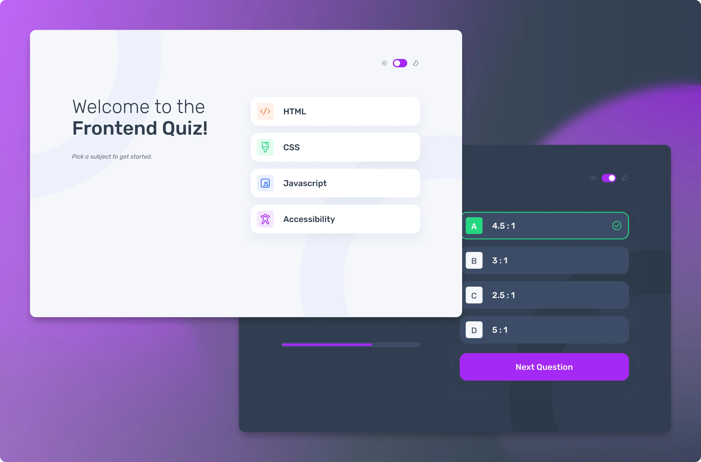

  
  
  
  
  <!--  -->
  
  
  

# Hi 👋 there!

So glad you've dropped by my coding corner. Here, it's all about web design,
coding magic.

Between coding sessions, I'm probably out cycling 🚴‍♂️ or having fun annoying my
kids (they secretly love it 😁).

Dive 👀 into my projects, see what sparks joy, and let's chat 💬 about anything
from tech to the best cycling routes.

Happy exploring!

# Project: Frontend Quiz React App

3Intermediat

### Requirements

Build quiz app and get it looking as close to the design as possible.

Your users should be able to:

- Select a quiz subject
- Select a single answer from each question from a choice of four
- See an error message when trying to submit an answer without making a selection
- See if they have made a correct or incorrect choice when they submit an answer
- Move on to the next question after seeing the question result
- See a completed state with the score after the final question
- Play again to choose another subject
- View the optimal layout for the interface depending on their device's screen size
- See hover and focus states for all interactive elements on the page
- Navigate the entire app only using their keyboard
- Bonus: Change the app's theme between light and dark

### Tech Stack:

- HTML5;
- CSS3;
- TypeScript
- React
- TailwindCSS
- Vite
- Npm

### Links

<!--
- Solution URL:
  [FrontendMentor Solution Hub]() -->
<!-- - Live Site URL:
  [Live Preview at Vercel]() -->

## Author

- Frontend Mentor -
  [Grifano Serhii Orlenko profile](https://www.frontendmentor.io/profile/grifano)
- LinkedIn - [Serhii Orlenko](https://www.linkedin.com/in/grifano/)
